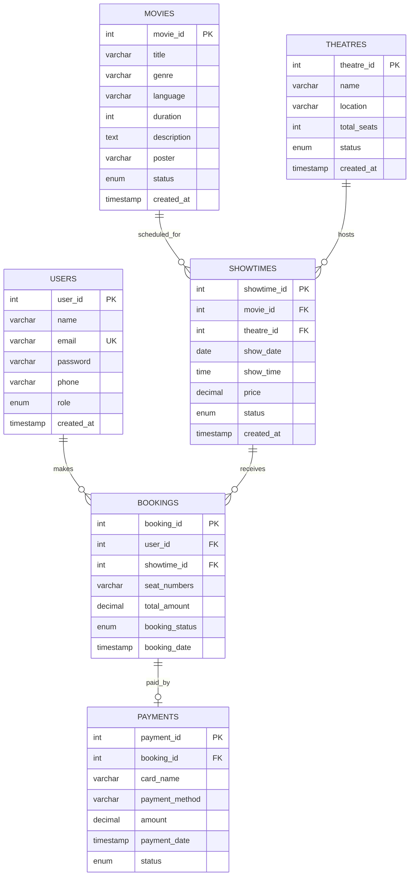

# Project Report

## Project Title

CineBook - Movie Ticket Booking System

## Group Member Details

| Student Name | Student ID | Role |
|---|---|---|
| Add member name | Add ID | Backend and database |
| Add member name | Add ID | Frontend and testing |
| Add member name | Add ID | Documentation |

## GitHub Repository Link

https://github.com/your-username/movie-ticket-booking-system

## Project Description

CineBook is a dynamic web application designed for a cinema that has many theatres. Users can browse available movies, view movie details, choose a theatre and showtime, select one or more seats, simulate payment, and view or cancel their bookings. Administrators can manage movies, theatres, showtimes, and booking records through a protected admin panel.

The system uses PHP for server-side processing, MySQL for persistent storage, HTML/CSS/JavaScript for the interface, Bootstrap for responsive components, and Object-Oriented Programming to separate business logic from page presentation.

## System Functions and Features

- User registration with validation
- User login and logout
- Role-based access control for admin pages
- Home page with featured movies and upcoming showtimes
- Movie listing page with search, genre filter, and language filter
- Movie details page with available showtimes
- Seat booking page with selected-seat summary
- Booked seats are disabled to prevent duplicate booking
- Payment simulation with card field validation
- My Bookings page with booking history and cancellation
- Admin dashboard with totals and recent records
- Admin movie CRUD
- Admin theatre CRUD
- Admin showtime CRUD
- Admin booking management
- Responsive design for desktop, tablet, and mobile

## Use of Object-Oriented Programming

The project uses OOP to keep the application organized and maintainable.

| Class | Responsibility |
|---|---|
| `Database` | Creates and reuses the PDO database connection. |
| `User` | Handles registration, login, user lookup, and user statistics. |
| `Movie` | Handles movie creation, reading, updating, deleting, filtering, and featured movie display. |
| `Theatre` | Handles theatre creation, reading, updating, deleting, and counting. |
| `Showtime` | Handles movie-theatre scheduling, joined showtime display, and CRUD operations. |
| `Booking` | Handles seat booking, booking history, cancellation, booked-seat lookup, and revenue totals. |
| `Payment` | Handles simulated payment record creation and payment lookup. |

Encapsulation is used by keeping database operations inside classes instead of writing SQL directly in every page. Reusability is shown through shared methods such as `create()`, `update()`, `delete()`, `find()`, and `all()`. Abstraction is used by allowing pages to call clear class methods without needing to know the lower-level PDO implementation.

## Technologies Used

| Technology | Purpose |
|---|---|
| PHP 8 | Server-side programming and form handling |
| MySQL | Database storage |
| PDO | Secure database access with prepared statements |
| HTML5 | Page structure |
| CSS3 | Custom responsive styling |
| JavaScript | Client-side validation and seat-selection updates |
| Bootstrap 5 | Responsive layout and components |
| Bootstrap Icons | Interface icons |
| XAMPP/WAMP | Local development server |

## Database Design

The database contains six main tables:

- `users`
- `movies`
- `theatres`
- `showtimes`
- `bookings`
- `payments`

Relationships:

- One user can make many bookings.
- One movie can have many showtimes.
- One theatre can host many showtimes.
- One showtime can receive many bookings.
- One booking can have one payment.

## ER Diagram

## Validation

Client-side JavaScript validation is used for:

- Password matching
- Seat selection summary
- Maximum 8 seats per booking
- Payment card number formatting
- Payment expiry and CVV checks

Server-side PHP validation is used for:

- Required fields
- Valid email format
- Unique email registration
- Password length
- Valid phone number
- Movie duration range
- Theatre seat capacity range
- Valid showtime price
- Seat availability before booking
- Admin access restrictions

## Security Considerations

- Passwords are stored using PHP `password_hash()`.
- Login checks use `password_verify()`.
- PDO prepared statements are used for database queries.
- Output is escaped with `htmlspecialchars()`.
- Session-based authentication protects user and admin pages.
- CSRF tokens protect POST forms.
- Role checks prevent normal users from accessing admin pages.

## Testing

Suggested test cases:

| Test Case | Expected Result |
|---|---|
| Register with invalid email | Error message displayed |
| Register with existing email | Duplicate email error |
| Login with admin account | Redirects to admin dashboard |
| Add movie from admin panel | Movie appears in movie list |
| Update theatre seats | Updated value appears in theatre table |
| Add showtime | Showtime appears on movie details page |
| Select seats and continue | Pending booking is created |
| Complete payment | Booking status becomes Confirmed |
| Cancel booking | Booking status becomes Cancelled |
| Normal user opens admin URL | User is redirected away |

## Conclusion

CineBook fulfills the assignment requirements by providing a complete dynamic movie ticket booking system with frontend pages, backend processing, database integration, OOP classes, CRUD modules, authentication, validation, and a responsive interface. The project is organized for GitHub submission and can be run locally using XAMPP or WAMP.
